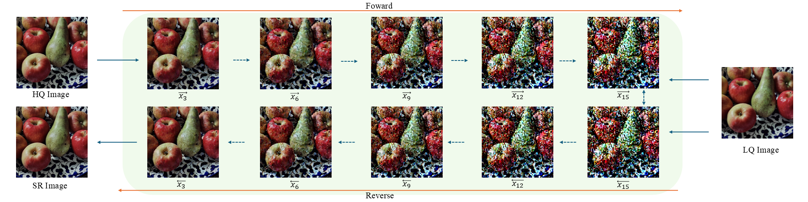
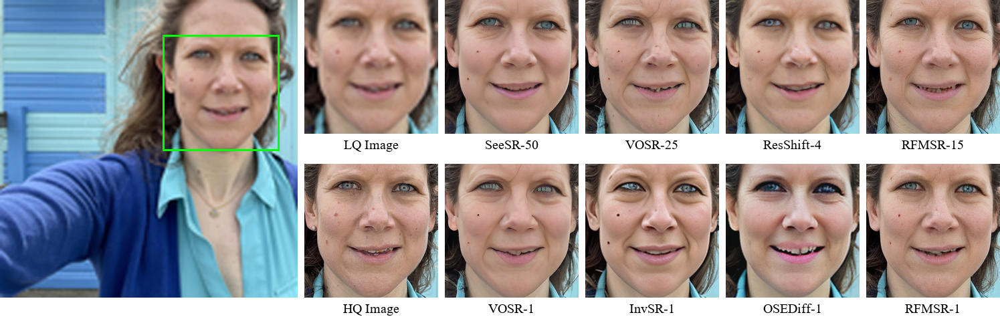
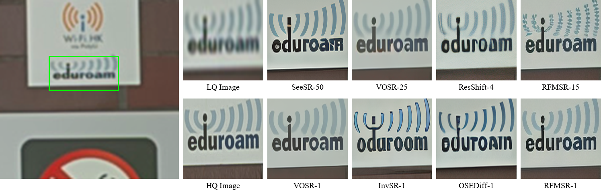
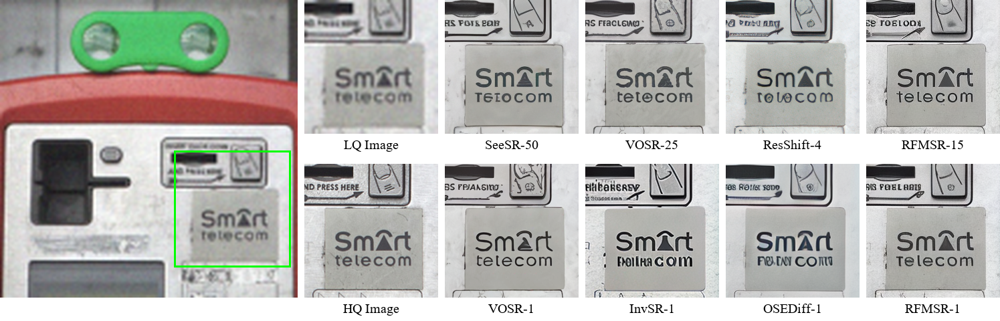
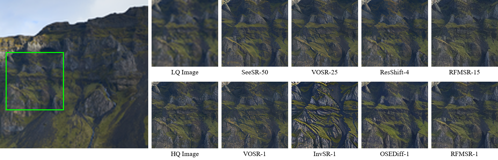

<div align="center">

# RFMSR: Residual Flow Matching for Image Super-Resolution

[](https://arxiv.org/abs/2607.12753)
[](https://huggingface.co/frozen2001/RFMSR)

</div>

<p align="center">
  
</p>
<p align="center"><em>Overview of the RFMSR framework. <b>Forward:</b> the residual flow progressively injects noise into the HQ latent along the residual path (HQ → LR). <b>Reverse:</b> the network learns to denoise and recover the HQ latent from the LR condition, yielding the SR result.</em></p>


## News

- **2026-07** — Initial release: training & inference code, one-step and multi-step checkpoints.


## Preparation

### Hardware Requirements

- **GPU VRAM**: >= 16 GB (recommended >= 24 GB for training)
- Recommended: A100 / RTX 4090 / 3090

### Installation

**Python >= 3.10** (recommended 3.10 ~ 3.12)

```bash
# 0. Create virtual environment (recommended)
conda create -n rfmsr python=3.12 -y
conda activate rfmsr

# 1. Install PyTorch (CUDA version)
pip3 install torch torchvision --index-url https://download.pytorch.org/whl/cu130

# 2. Install other dependencies
pip install -r requirements.txt

# 3. (Optional) Install xformers for memory-efficient attention
pip install xformers
```

### Pretrained Weights

All pretrained weights are available at [frozen2001/RFMSR](https://huggingface.co/frozen2001/RFMSR). Download the `ckpts/` folder to the RFMSR project root.

```bash
# 1. Install huggingface-cli
pip install huggingface_hub

# 2. Download the ckpts/ folder to RFMSR project root
huggingface-cli download frozen2001/RFMSR ckpts/ --local-dir . --local-dir-use-symlinks False
```

| File | Description |
|------|-------------|
| `rfmsr.safetensors` | Phase I — multi-step Flow Matching model |
| `rfmsr_os.safetensors` | Phase II — one-step model |
| `rfmsr_consistency.safetensors` | Consistency distillation — one-step model |

### Data Preparation

Training data (`traindata/`): place HR images (DIV2K, Flickr2K, etc.) directly under this directory.

Validation data (`assets/validate_gt/`, `assets/validate_lq/`): paired 512x512 HR/LR images for validation during training.

Test data (`testdata/`): LSDIR, ImageNet512, and RealSR benchmarks for evaluation.


## Training

### Stage 1: Multi-step Flow Matching

Train the LightningDiT with Residual Flow Matching (velocity prediction):

```bash
python train_rfmsr.py
```

Key configuration in `configs/train_rfmsr.yaml`:
- 10,000 iterations, batch size 32, GT crop 512x512
- Learning rate 5e-5, EMA rate 0.999, bf16 AMP
- RealESRGAN degradation pipeline (blur + noise + JPEG + resize)
- Pretrained init from VOSR checkpoint (optional)


### Stage 2: One-Step Training

Train a one-step generator with perceptual and adversarial losses:

```bash
python train_rfmsr_os.py
```

Key configuration in `configs/train_rfmsr_os.yaml`:
- Losses: velocity supervision + LPIPS (VGG) + Hinge GAN
- PatchGAN discriminator in 4-channel latent space
- Initialized from `ckpts/rfmsr.safetensors`
- Validation runs both 1-step and 15-step inference for comparison


## Inference

### Quick Start

```bash
# One-step inference (fast, recommended)
python infer_rfmsr.py --input input.png --steps 1

# Multi-step inference (higher quality)
python infer_rfmsr.py --input input.png --steps 15

# Process a folder
python infer_rfmsr.py --input ./test_images/ --scale 4.0 --steps 15
```

### Command-Line Arguments

| Argument | Default | Description |
|----------|---------|-------------|
| `--input` | (required) | Input image or directory |
| `--rfmsr_path` | `ckpts/rfmsr_os.safetensors` | Path to RFMSR checkpoint |
| `--scale` | 4.0 | Upscale factor |
| `--steps` | 15 | Reverse integration steps (1 for one-step) |
| `--flow_sigma` | 1.0 | Noise standard deviation |
| `--seed` | 42 | Random seed |
| `--color_correction` | wavelet | Color correction: `adain` / `wavelet` / `ycbcr` / `none` |
| `--chopping` | True | Tiled inference for large images |
| `--tile_size` | 512 | Pixel-space tile size |
| `--tile_stride` | 256 | Sliding window stride |
| `--vae_path` | `ckpts/stable-diffusion-2-1-base` | SD2.1 VAE path |
| `--denoise_device` | cuda | Device for RFMSR + VAE |
| `--output` | outputs | Output directory |

### One-Step vs Multi-Step

| Mode | Steps | Speed | Quality | Use Case |
|------|-------|-------|---------|----------|
| One-step (`rfmsr_os`) | 1 | Fast | Good | Real-time / batch processing |
| Multi-step (`rfmsr`) | 15 | Slower | Best | Maximum quality |


## Evaluation

Run the metrics script to compute PSNR, SSIM, LPIPS, DISTS, NIQE, MUSIQ, MANIQA, and CLIPIQA between SR results and GT images (paired by filename):

```bash
python utils/cal_metrics.py --gt_dir testdata/RealSR/HR --sr_dir outputs/RealSR
```


## Visual Comparisons

Below are qualitative comparisons on benchmark datasets. Each figure shows the low-quality (LQ) input, ground-truth high-quality (HQ) image, and results from competing methods (SeeSR, VOSR, ResShift, InvSR, OSEDiff) alongside RFMSR in both multi-step (15-step) and one-step modes. RFMSR preserves fine textures, text clarity, and natural details while avoiding hallucination and artifacts.

### Portrait

<p align="center">
  
</p>
<p align="center"><em>Portrait super-resolution (4×). RFMSR-15 and RFMSR-1 faithfully recover facial details without over-smoothing or hallucinated artifacts.</em></p>

### Text & Logo

<p align="center">
  
</p>
<p align="center"><em>Text super-resolution (4×). RFMSR preserves sharp letter edges and correct glyph shapes, while one-step baselines (VOSR-1, InvSR-1, OSEDiff-1) introduce distortion or miss strokes.</em></p>

<p align="center">
  
</p>
<p align="center"><em>Another text example (4×). RFMSR-1 achieves comparable fidelity to the 15-step model, demonstrating strong one-step distillation.</em></p>

### Landscape & Nature

<p align="center">
  
</p>
<p align="center"><em>Landscape super-resolution (4×). RFMSR recovers fine rock and grass textures without the blurriness or over-sharpening seen in competing methods.</em></p>


## Contact

For questions or collaboration, please open an issue on GitHub or contact [frozen2001@hust.edu.cn](mailto:frozen2001@hust.edu.cn).

## Acknowledgements

This project builds upon the following open-source works:

- [VOSR](https://github.com/CSWRY/VOSR)
- [Stable Diffusion 2.1](https://huggingface.co/Manojb/stable-diffusion-2-1-base)
- [Real-ESRGAN](https://github.com/xinntao/Real-ESRGAN)
- [LPIPS](https://github.com/richzhang/PerceptualSimilarity)
- [BasicSR](https://github.com/XPixelGroup/BasicSR)

## Citation

If you find this work useful, please cite:

```bibtex
@article{rfmsr2026,
  title={RFMSR: Residual Flow Matching for Image Super-Resolution},
  author={},
  journal={},
  year={2026}
}
```
